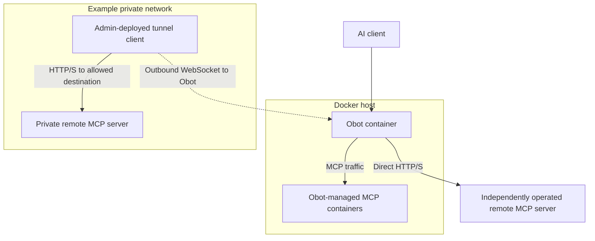
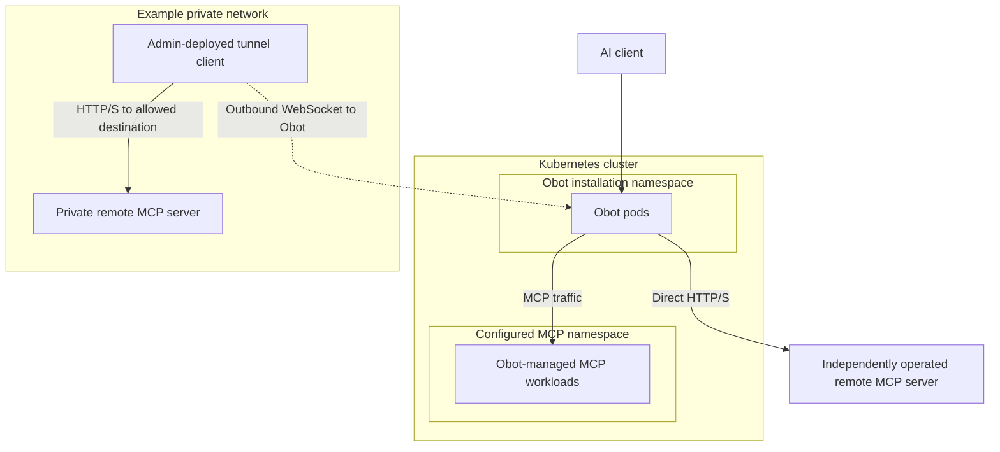

Start with where you install Obot: Docker or Kubernetes. Within either installation, Obot can launch hosted MCP servers, connect directly to remote MCP servers, and reach private remote MCP servers through an admin-deployed tunnel client. One installation can use all three arrangements.

The examples below show the standard Docker and Helm installations. They distinguish the Obot application, the MCP workloads it manages, and services deployed independently of Obot.

## Obot on Docker

### Where Obot runs

Obot runs as a container on a Docker host. The evaluation installation includes PostgreSQL in the Obot container and mounts a persistent data volume. See [Docker evaluation](../installation/docker-deployment.md) for installation and authentication setup.

### Where MCP servers run

| MCP arrangement | Placement and responsibility |
|---|---|
| Hosted by Obot | Obot launches separate sibling containers through the host Docker daemon. MCP servers run alongside the Obot container. |
| Remote, directly reachable | A vendor or your organization operates the MCP service independently, on another host, in a cluster, or as a hosted service. Obot connects to its HTTP/S endpoint. |
| Private remote service | The service remains on its private network. An admin deploys a tunnel client where it can reach that service and establish an outbound connection to Obot. |

The tunnel client is deployed separately by an admin, as a CLI process or container. It may run on the private MCP server's machine or another machine with the required connectivity. Obot does not launch the tunnel client. The dashed arrow shows who establishes the connection; Obot forwards MCP requests back through that established tunnel.

The Docker installation mounts the host Docker socket to launch MCP workloads. Treat users who can deploy server code as trusted on that host. Use this installation for development, evaluation, or trusted single-tenant use.

## Obot on Kubernetes

### Where Obot runs

The Helm installation runs Obot as pods in the installation's namespace. Configure an external PostgreSQL database, persistent or object storage, and encryption separately. AWS EKS, Azure AKS, and Google GKE are examples of where you can run this Kubernetes installation. See [Kubernetes production deployment](../installation/kubernetes-deployment.md) and the [cloud deployment guides](../operations/cloud.md).

### Where MCP servers run

| MCP arrangement | Placement and responsibility |
|---|---|
| Hosted by Obot | Obot creates separate MCP workloads in the configured MCP namespace, normally in the same cluster. With a Helm release named `obot`, the default MCP namespace is `obot-mcp`. |
| Remote, directly reachable | A vendor or your organization operates the service independently. Its location can be another cluster, a VM, or a hosted service; Obot connects to its reachable HTTP/S endpoint. |
| Private remote service | An admin deploys a tunnel client with access to the service's private network. The client may be a CLI process, container, or a separately managed pod, and must also reach Obot. |

The tunnel client is not one of the MCP workloads Obot deploys. An admin chooses its location and manages its lifecycle. The private network in the diagram can be a separate cluster or network segment; the requirement is connectivity from the tunnel client to both the private service and Obot.

Kubernetes provides independently configurable pod security, network policy, and sandbox runtimes for hosted MCP workloads. Those controls do not configure the independently operated remote services or tunnel clients. See [MCP workload configuration](../configuration/mcp-deployments-in-kubernetes.md) and [Network and workload isolation](../security/isolation.md).

For multiple Obot replicas, use an external database and plan shared storage for any files the replicas must access. See [Capacity and high availability](../operations/capacity.md) and [Data storage and lifecycle](./data-lifecycle.md).

## Tunnel ownership and connection direction

In either installation type, the tunnel has two ends:

| End | Runs where | Managed by |
|---|---|---|
| Receiving endpoint | Inside the Obot application, at `/tunnel/connect` | Provided by Obot |
| Tunnel client (`obot tunnel`) | A machine or pod that can reach the private MCP service and Obot | Deployed and operated externally by an admin |

An Admin or Owner creates the tunnel record and allowed-URL rules in Obot, then uses the generated secret to run the client externally. Creating the record does not deploy a client or an MCP server.

The tunnel client establishes an outbound WebSocket connection to Obot. When an AI client calls the configured remote MCP server through Obot, Obot sends the request over that connection. The tunnel client forwards it to the allowed HTTP/S destination and returns the response. The tunnel client needs no inbound listening port; the private MCP service must still accept connections from it.

Use a tunnel when Obot cannot directly reach the remote service. A directly reachable remote server does not need one, and tunnel placement does not depend on whether Obot itself runs on Docker or Kubernetes. Follow [Create and run an MCP tunnel](../mcp-gateway/filters-tunnels.md#mcp-tunnels-create-an-mcp-tunnel) for setup and the [tunnel operations reference](../functionality/mcp-tunnels.md) for connection handling and secret rotation.
