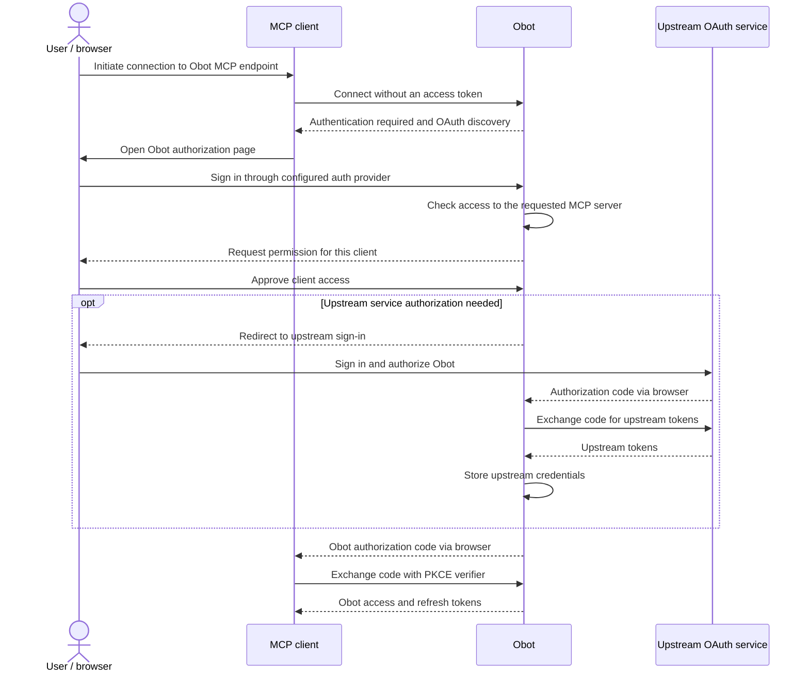
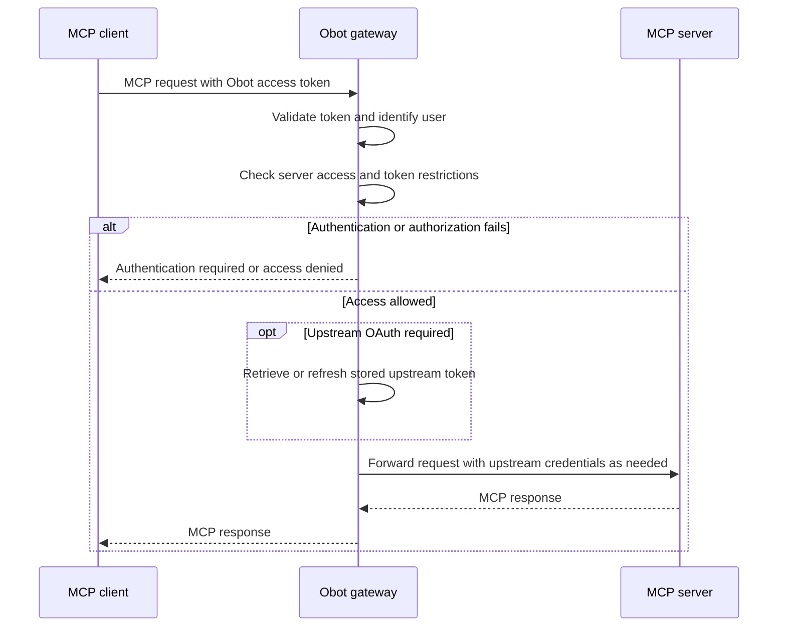

# Architecture

Obot connects AI clients and user devices with hosted services and external providers. It provides MCP and LLM gateways, hosting, identity and access control, audit logs, and MCP and Skills registries.

## Key Concepts

- **MCP Clients**: Agents and applications that consume MCP tools, prompts, and resources, including desktop clients and Obot Agent.
- **MCP Registry**: An index of MCP servers with metadata about how to run them and where to find them.
- **MCP Gateway**: The proxy inside Obot that authenticates and authorizes requests, records audit data, invokes filters, enforces their responses, and forwards allowed traffic. See [MCP Gateway](./mcp-gateway.md).
- **MCP Hosting**: Obot manages separate Docker containers or Kubernetes workloads for hosted servers. Remote servers remain on external infrastructure. See [MCP Hosting](./mcp-hosting.md).
- **Filters**: Hosted or remote MCP servers that expose a filter tool, or external HTTP webhooks reached through a hosted adapter. Filter code runs separately from Obot; Obot calls it and applies the result. See [Filters](../functionality/filters.md).
- **LLM Gateway**: A proxy between chat clients and LLM providers for monitoring and controlling model communications.

## Authentication Flow

Obot handles two separate authorizations: the user's permission for an MCP client to access Obot, and, when needed, permission for Obot to access an upstream MCP service on the user's behalf.

### Connecting an MCP Client

The user initiates a connection to an Obot MCP endpoint from their MCP client. The following flow shows a public client using OAuth with PKCE. The user signs in with the configured [auth provider](../configuration/auth-providers.md), then approves the client's access. Obot checks the user's permission to access the requested MCP server; approving the client does not grant additional server access.

The upstream authorization step is skipped when it is unnecessary or an existing authorization is usable. The client receives Obot tokens; upstream credentials remain with Obot.

### Authorizing MCP Requests

Once connected, the client sends its Obot access token with MCP requests. Obot validates the token, identifies the user, and checks both the user's current server access and the token's permitted servers. Access checks use ownership and applicable [MCP access policies](../functionality/mcp-access-policies.md), including user and group rules.

Clients using an existing Obot token or MCP API key begin with authenticated requests. Obot credentials authorize access to the gateway; upstream credentials authorize Obot's connection to the MCP service.

## Data Persistence

- **Database**: Postgres stores configuration, metadata, and audit data. In production, host it independently of the Obot deployment.
- **Published Workflow Storage**: Optional S3, GCS, Azure Blob Storage, or S3-compatible storage for published workflows. If unset, Obot stores published workflows on local disk.
- **Agent State**: Stores files and other data for Obot Agent. External volumes can provide persistence.

## Encryption

Application-level encryption is disabled by default. When configured, an encryption provider protects selected database fields and credential values, including sensitive audit payloads; it does not encrypt entire records or automatically backfill all historical data. Local passwords are hashed independently of this setting. See [Encryption Providers](../configuration/encryption-providers/overview.md) for field coverage and existing-data considerations.

## LLMs

Obot supports multiple model providers, available without Community registration or an Enterprise license. Configure upstream credentials and models for your organization. See [Model Providers](../configuration/model-providers.md).
