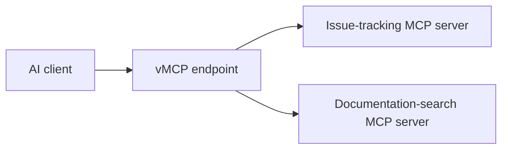

# vMCP overview {#mcp-gateway}

A virtual MCP (vMCP) is a connection endpoint for selected tools from one or more MCP servers. You build it from servers in the Obot catalog, choose which tools to expose, and connect your AI client using one URL.

For example, a team can combine issue-tracking and documentation-search tools in one vMCP. Each team member adds that vMCP to their client instead of configuring a separate connection to each server.

## Shared and personal vMCPs

- **Shared vMCPs** are created by administrators for users and groups. Each recipient can use the tools they have been granted access to.
- **Personal vMCPs** are assembled from catalog servers available to their owner and are accessible only to that owner.

## Where to go next

- [Create a vMCP](../start-here/govern.md) from catalog servers, or use the [configuration guide](../mcp-gateway/server-types.md) for more options.
- [Share a vMCP](../mcp-gateway/publish.md) with your team.
- [Connect to a vMCP](../start-here/connect.md) that is ready to use.

## How the gateway fits in {#gateway-architecture}

The vMCP defines the endpoint your client connects to. The MCP Gateway handles the requests behind it: authenticating callers, enforcing access, applying filters, and recording activity. See [request flows and trust boundaries](../architecture/request-flows.md) for the architecture, [Control MCP access](../mcp-gateway/access.md) for permissions, and [Filter MCP traffic](../functionality/filters.md) for content checks.
