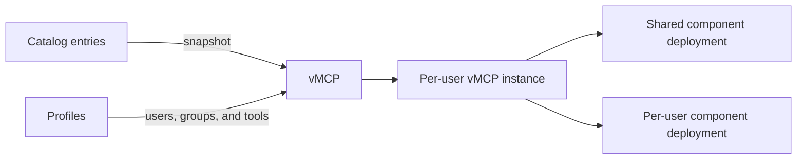

# Virtual MCPs (vMCPs)

A virtual MCP (vMCP) exposes one or more MCP servers through one Obot Gateway endpoint. The source servers become **components** of the vMCP. Each component keeps its own deployment and configuration behavior, while the vMCP provides one place to manage the connection, tools, and access.

:::warning Transitional release

vMCPs are in a transitional state. Legacy MCP server connections continue to work in this release, but new connection workflows should use vMCPs.

In a future release, Obot will migrate all MCP servers to vMCPs, and vMCPs will be the only way to connect to MCP servers through the Obot Gateway.

GitOps synchronization currently manages MCP catalog entries, not vMCPs. Direct GitOps synchronization of vMCP definitions is planned for a future release.

:::

## How vMCPs work



The main resources are:

- **Catalog entry**: Defines how an MCP server runs or where a remote server is located.
- **vMCP component**: A snapshot of a catalog entry, plus its configuration policy and exposed tools.
- **vMCP**: One stable connection endpoint containing one or more components.
- **Profile**: An administrator-defined grant that makes a shared vMCP and selected tools available to users or groups.
- **vMCP instance**: A user's connection state, credentials, and optional tool selection for a vMCP.

A vMCP with one component replaces a standalone MCP server connection. A vMCP with several components replaces a composite server and aggregates their tools behind the same endpoint.

## Shared and personal vMCPs

The creator's role determines the scope of a new vMCP.

| | Administrator-created shared vMCP | User-created personal vMCP |
|---|---|---|
| Who can use it | Users and groups granted access by profiles | Its author only |
| Source catalog access for consumers | Not required | The owner must have access to every selected catalog entry |
| Access management | Administrators manage profiles and tool grants | Cannot be shared; profiles do not change its owner-only scope |
| Component access changes | Consumer catalog access does not remove components | Losing access to a catalog entry removes that component |
| Typical use | Publish a governed tool endpoint for a team or organization | Assemble a private endpoint from servers available to the user |

Only administrators can create a vMCP that other users can consume. Any user who can access catalog entries can use them in a personal vMCP, but non-administrators cannot publish that vMCP to other users or groups.

### Create a shared vMCP as an administrator

1. Open **vMCPs** and select **Create vMCP**.
2. Drag an MCP server from the **MCP Servers** panel onto the vMCP. Repeat to add more components.
3. Enter a name and description, then select **Create**.
4. For each component, choose how every configuration field is supplied. See [Configuration policies](#configuration-policies).
5. Configure the component's exposed tools. You can disable tools, rename them, change their descriptions, or add a prefix to avoid name collisions.
6. Open **Profiles** and replace or refine the default access grant. Assign users, groups, or **All Obot Users**, then choose the tools that profile grants.
7. Connect to or test the vMCP after its components are ready.

:::note

A new administrator-created shared vMCP includes a default profile that grants all administrators access to every component. Administrators can replace or refine this profile to grant access to other users or groups. A personal vMCP remains accessible only to its owner.

:::

Profiles are grant-only and additive. If a user matches several profiles, Obot combines their tool grants. A narrower profile cannot deny a tool granted by another matching profile, so review broad profiles when troubleshooting unexpected access.

### Create a personal vMCP as a user

1. Open **vMCPs** and select **Create vMCP**.
2. Drag MCP servers available to you from the **MCP Servers** panel onto the vMCP.
3. Enter a name and description, then select **Create**.
4. Choose the configuration policy and exposed tools for each component.
5. Select **Connect** to configure and launch your connection.

The personal vMCP is accessible only by its owner, and the owner has no **Profiles** view. Selecting **Provided at connection** prompts the owner for that value when connecting.

If the owner later loses access to a selected MCP server, Obot removes that component and its component-specific configuration from the personal vMCP. If no components remain, Obot removes the personal vMCP and its instance. Deleting a source catalog entry is different: its existing snapshot can continue to run as described in [Snapshots and updates](#snapshots-and-updates).

## Configuration policies

When a catalog entry declares configuration, the vMCP creator assigns one policy to each field.

| UI option | Behavior |
|---|---|
| **Preconfigured** | The creator supplies one fixed value used by every connection. |
| **Provided at connection** | Each connecting user supplies a value stored with that user's vMCP instance. |
| **Ignore** | The vMCP does not accept or supply a value for the field. |

Required fields must be either **Preconfigured** or **Provided at connection**. Optional fields default to **Ignore** in the UI.

Configuration also determines whether a component can share a deployment:

- A component with only fixed or ignored configuration is normally eligible to use a shared deployment.
- User-provided headers remain isolated per connection but do not require separate deployments.
- Any other user-provided value causes Obot to run a separate component deployment for each user.
- **Force single-user** always gives each user a separate deployment when that option is available.

Obot makes this decision independently for every component. One vMCP can therefore use shared and per-user component deployments at the same time.

## Tools and profiles

Tool controls apply in layers:

1. The component configuration defines the tools the vMCP can expose. Disabling a tool here prevents every profile and user from using it.
2. Each matching profile grants all or a subset of those component tools.
3. A user's vMCP instance may narrow its selection further, but it cannot enable a tool outside the combined profile grant.

When several components expose the same tool name, configure a component prefix or rename a tool so clients receive unique names. Refreshing tool information may require the component's fixed configuration and OAuth authentication.

## Connect to a vMCP

Using a vMCP's connection URL in an MCP client of your choice will automatically create an instance on your first connection and you will be prompted to provide configuration or authenticate with any third-party services.

You can also setup a connection in the UI by:

1. Select **Connect** on the vMCP.
2. Select **Continue** or **Configure** when prompted.
3. Supply fields marked **Provided at connection**.
4. Complete upstream OAuth authentication if a component requires it.
5. Copy the **Connection URL** or use the instructions for a supported client.

The endpoint uses streamable HTTP and has this form:

```text
https://your-obot-instance/mcp-connect/{vmcp-id}
```

Reconnecting or updating configuration reuses that instance instead of creating another connection identity. Each user authenticates to the Obot Gateway and receives only the tools granted to that user.

Use **Test vMCP** beside the connection action to configure the connection if needed and open Obot's MCP tester.

## Snapshots and updates

Adding a component copies a snapshot of its catalog entry into the vMCP. The running component uses that snapshot, not the mutable MCP server configuration.

- Changing a source MCP server does not automatically change an existing vMCP.
- Obot reports when a newer source definition is available. Adopting it is an explicit vMCP update.
- If the source entry is deleted or temporarily unavailable, the stored snapshot remains usable.
- Deleting a catalog entry is therefore not an emergency stop. Delete the affected vMCP when it must no longer run.

The snapshot makes deployments stable and reviewable, but it also means an older or vulnerable definition can remain active until an administrator updates or deletes the vMCP.

## GitOps and migration

In this release, [MCP Server GitOps](../configuration/mcp-server-gitops.md) synchronizes catalog entries that can be selected as vMCP components. It does not synchronize vMCP definitions, profiles, configuration policies, or component tool selections.

Direct vMCP GitOps synchronization is planned for the next release, alongside migration of existing MCP servers to vMCPs. Until then, legacy MCP server connections remain available for compatibility. Build new connections as vMCPs and update clients to use their vMCP connection URLs.
