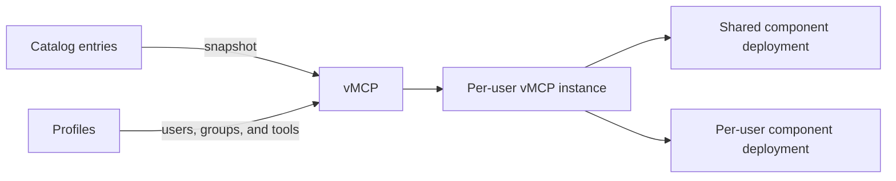

Define a server in the catalog, then add it to a vMCP and choose how its configuration values are supplied. The catalog entry describes how a hosted server runs or where a remote server is located. The vMCP is where you decide which values are shared and which each connecting user provides.

## Prerequisites {#define-the-catalog-entry}

vMCPs are built from existing catalog entries. Before creating one, make sure the required servers are available in **MCP Servers**. See [Hosted MCP servers](../concepts/mcp-hosting.md) or [Register remote servers](./register-remote.md) to add missing entries. A personal vMCP's owner must have access to the entries they use.

## How vMCPs work {#virtual-mcps-how-vmcps-work}

The main resources are:

- **Catalog entry**: Defines how an MCP server runs or where a remote server is located.
- **vMCP component**: A snapshot of a catalog entry, plus its configuration policy and exposed tools.
- **vMCP**: One stable connection endpoint containing one or more components.
- **Profile**: An administrator-defined grant that makes a shared vMCP and selected tools available to users or groups.
- **vMCP instance**: A user's connection state, credentials, and optional tool selection for a vMCP.

A vMCP with one component replaces a standalone MCP server connection. A vMCP with several components replaces a composite server and aggregates their tools behind the same endpoint.

## Shared and personal vMCPs {#virtual-mcps-shared-and-personal-vmcps}

The creator's role determines the scope of a new vMCP.

| | Administrator-created shared vMCP | User-created personal vMCP |
|---|---|---|
| Who can use it | Users and groups granted access by profiles | Its author only |
| Source catalog access for consumers | Not required | The owner must have access to every selected catalog entry |
| Access management | Administrators manage profiles and tool grants | Cannot be shared; profiles do not change its owner-only scope |
| Component access changes | Consumer catalog access does not remove components | Losing access to a catalog entry removes that component |
| Typical use | Publish a governed tool endpoint for a team or organization | Assemble a private endpoint from servers available to the user |

Only administrators can create a vMCP that other users can consume. Any user who can access catalog entries can use them in a personal vMCP, but non-administrators cannot publish that vMCP to other users or groups.

### Create a shared vMCP as an administrator {#virtual-mcps-create-a-shared-vmcp-as-an-administrator}

1. Open **vMCPs** and select **Create vMCP**.
2. Drag an MCP server from the **MCP Servers** panel onto the vMCP. Repeat to add more components.
3. Enter a name and description, then select **Create**.
4. For each component, choose how every configuration field is supplied. See [Configuration policies](./server-types.md#virtual-mcps-configuration-policies).
5. Choose **Managed** in the **Add Tools** dialog to discover and select the component's exposed tools. You can disable tools, rename them, change their descriptions, or add a prefix to avoid name collisions. **As-is** instead passes through the upstream tools and definitions, including future changes, without discovery during setup.
6. Open **Profiles** and replace or refine the default access grant. Assign users, groups, or **All Obot Users**, then choose the tools that profile grants.
7. Connect to or test the vMCP after its components are ready.

:::note

A new administrator-created shared vMCP includes a default profile that grants all administrators access to every component. Administrators can replace or refine this profile to grant access to other users or groups. A personal vMCP remains accessible only to its owner.

:::

Profiles are grant-only and additive. If a user matches several profiles, Obot combines their tool grants. A narrower profile cannot deny a tool granted by another matching profile, so review broad profiles when troubleshooting unexpected access.

### Create a personal vMCP as a user {#virtual-mcps-create-a-personal-vmcp-as-a-user}

1. Open **vMCPs** and select **Create vMCP**.
2. Drag MCP servers available to you from the **MCP Servers** panel onto the vMCP.
3. Enter a name and description, then select **Create**.
4. Choose the configuration policy and exposed tools for each component.
5. Select **Connect** to configure and launch your connection.

The personal vMCP is accessible only by its owner, and the owner has no **Profiles** view. Selecting **Provided at connection** prompts the owner for that value when connecting.

If the owner later loses access to a selected MCP server, Obot removes that component and its component-specific configuration from the personal vMCP. If no components remain, Obot removes the personal vMCP and its instance. Deleting a source catalog entry is different: its existing snapshot can continue to run as described in [Snapshots and updates](./publish.md#virtual-mcps-snapshots-and-updates).

## Choose how values are supplied

### Configuration policies {#virtual-mcps-configuration-policies}

When adding a server to a shared vMCP, configure each field that still needs a value:

| vMCP option | Who supplies the value |
|---|---|
| **Preconfigured** | The vMCP creator sets the value once. Every connection to that server within the vMCP uses it. |
| **Provided at connection** | Each user supplies their own value when connecting to the vMCP. |
| **Ignore** | No value is supplied for an optional field. |

For example, preconfigure a shared region or service-account credential, and request a personal API token at connection time. You can use both options on different fields of the same server. Required fields must be **Preconfigured** or **Provided at connection**.

After configuring the values, select the exposed tools and use [profiles](./access.md#virtual-mcps-tools-and-profiles) to grant access. Preconfiguring a value shares it across that vMCP's connections; it does not grant everyone in Obot access to the vMCP.

Optional fields default to **Ignore** in the UI.

For a [Git-managed vMCP](../configuration/mcp-server-gitops.md#vmcp-definitions), configuration policies are defined in YAML. A `fixed` field can use a Kubernetes `secretBinding` instead of a clear-text value. This component-level binding is available only through Git catalog sources, requires the Kubernetes backend, and cannot override a static catalog field or accompany a `value`. Required fixed fields must have a value already stored for that component, a value supplied by the source, or a Secret binding before sync can create or update the vMCP.

## How configuration affects deployment

Configuration determines whether a component can share a deployment:

- A component with only fixed or ignored configuration is normally eligible to use a shared deployment.
- User-provided headers remain isolated per connection but do not require separate deployments.
- Any other user-provided value causes Obot to run a separate component deployment for each user.
- **Force single-user** always gives each user a separate deployment when that option is available.

Obot makes this decision independently for every component. One vMCP can therefore use shared and per-user component deployments at the same time.

Existing legacy single-user and multi-user connections remain available during the [vMCP transition](./publish.md#virtual-mcps-gitops-and-migration). Use vMCPs for new endpoints. Multiple components replace the former composite-server setup; `runtime: composite` is no longer supported in [catalog GitOps](../configuration/mcp-server-gitops.md).
