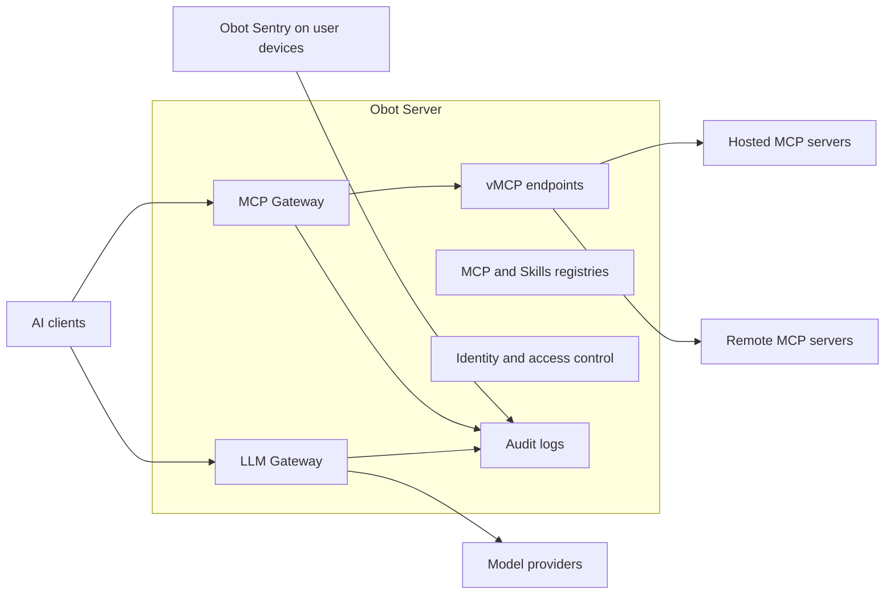

# What is Obot? {#obot}

Obot is an open-source platform for organizations to manage, secure, and govern their AI ecosystems. It provides shared infrastructure for connecting AI clients to models and tools, distributing approved MCP servers and skills, managing client access and credentials, hosting MCP servers, and recording activity across hosted services and user devices.

Obot does not require an organization to standardize on a single AI client, model provider, or tool ecosystem. Desktop agents and tools such as Claude Code, Codex, Cursor, VS Code, and other IDEs and CLIs can use the parts of the platform that apply to them.

## Getting Started

[Create a vMCP](./start-here/govern.md): select an MCP server from the catalog, choose its tools, share the endpoint, and connect your AI client.

If someone has already shared an endpoint with you, go straight to [Connect to a vMCP](./start-here/connect.md). If you need to install Obot first, use [Docker for evaluation](./installation/docker-deployment.md) or the [deployment guide](./installation/overview.md).

After your first tool call, [Explore Obot](./start-here/choose.md) to learn about model access, skills, and device management.

## Core Capabilities

### MCP Gateway

The [MCP Gateway](./concepts/mcp-gateway.md) is a single governed entry point to every MCP server a user is allowed to reach.

- Create [vMCPs](./mcp-gateway/server-types.md) from catalog servers and expose the tools your users need.
- [Share vMCPs](./mcp-gateway/publish.md) with users and groups through one connection URL.
- Add your own hosted or remote MCP servers when the catalog does not include what you need.
- Control [server and tool access](./mcp-gateway/access.md) by user or identity-provider group.
- Manage MCP OAuth, user and shared credentials, and Kubernetes [secret bindings](./concepts/mcp-hosting.md#mcp-servers-kubernetes-secret-bindings).
- Inspect, reject, or modify MCP requests and responses with MCP or webhook [filters](./functionality/filters.md).

### LLM Gateway

The [LLM Gateway](./llm-gateway/how-it-works.md) presents provider-compatible endpoints that AI clients use to reach approved models.

- Connect external AI clients to OpenAI, Anthropic, Amazon Bedrock, Azure, and Generic Responses Compatible providers.
- Keep provider credentials in Obot instead of distributing them to individual users or clients.
- Authenticate clients with scoped Obot API keys.
- Restrict the models visible and callable by each user through [Model Access Policies](./functionality/model-access-policies.md).
- Record requests and responses, client and session metadata, token usage, and estimated model cost.

### Hosted MCP Servers {#sandboxed-mcp-servers-and-agents}

Obot can run MCP servers in isolated execution environments outside the main Obot Server process.

- Host `npx`, `uvx`, and containerized [MCP servers](./concepts/mcp-hosting.md) as Docker containers or Kubernetes workloads.
- Apply [domain-based egress rules](./configuration/mcp-server-egress-control.md) to hosted MCP servers through a configured network-policy provider.

### MCP and Skills Registries

The MCP and Skills Registries centralize the discovery, installation, and management of MCP servers and Agent Skills.

- Curate MCP and Skills catalogs in Obot or index them from [Git-backed repositories](./configuration/mcp-server-gitops.md).
- Expose MCP catalogs through the standard [MCP Registry API](./functionality/mcp-registry-api.md).
- Publish approved MCP servers and [skills](./registries/publish-skills.md) to users and AI clients.
- Control access to individual entries, repositories, or complete catalogs with [MCP](./mcp-gateway/access.md) and [skill](./registries/publish-skills.md) access policies.
- Reuse centrally managed Git credentials across MCP and Skills catalog sources.
- Integrate with GitHub, GitLab, and other Git providers.

### Obot CLI and Skill

The [Obot CLI](./reference/cli-api.md) brings approved MCP servers and skills to users and their local AI clients, and the Obot skill teaches an agent to use the CLI itself.

- Search for and install approved skills.
- Search for approved MCP servers.
- Run and manage skills from the command line.
- Install the Obot skill so an agent can work with Obot on its own.

### Obot Sentry

[Obot Sentry](https://github.com/obot-platform/obot-sentry) extends Obot governance to AI activity occurring directly on user devices. [Device Management](./device-management/how-sentry-works.md) is currently beta.

- Enroll devices with the Obot Platform.
- Inventory installed AI clients, MCP servers, skills, and plugins.
- Install hooks for Claude Code, Codex, Cursor, and VS Code.
- Record local tool calls alongside activity passing through Obot gateways.
- Support monitoring and enforcement policies for AI activity on managed devices.
- Install manually or deploy through MDMs such as Microsoft Intune.

### Identity and Access Control

Obot governs who can reach each part of the platform, and with which credentials.

- Authenticate users through configured [identity providers](./configuration/auth-providers.md).
- Assign platform [roles and permissions](./security/policy-coverage.md).
- Control access to MCP servers, MCP tools, skills, models, and administrative APIs.
- Apply policies based on individual users or identity-provider groups.
- Issue scoped credentials for AI clients and automation.
- Restrict sensitive audit content to users with the appropriate role.

### Audit Logs and Visibility

Obot correlates activity across MCP servers, LLM providers, hosted workloads, and user devices.

- Record MCP requests and responses.
- Record LLM Gateway requests, responses, token usage, and model cost.
- Record local AI-client tool calls captured by Obot Sentry.
- Filter activity by user, server, tool, provider, model, client, device, or session.
- Track MCP and LLM usage across users and resources.
- Export [audit data](./security/audit-data.md) once or on a schedule.

## Architecture

The Obot Platform connects AI activity on user devices with services managed by or proxied through Obot Server.

On user devices, desktop agents and tools connect to Obot gateways, while Obot Sentry scans, audits, and enforces policy on AI activity taking place on the device. The Obot CLI lets users and AI clients discover, install, and manage approved MCP servers and skills.

Obot Server provides:

- MCP and LLM gateways for controlled access to MCP servers and model providers.
- Isolated execution for hosted MCP servers.
- Platform services for identity and access control, including permissions and secrets.
- Correlated audit logs of AI activity across the platform.
- MCP and Skills registries built on curated Git-backed catalogs.

Obot integrates with remote MCP servers, LLM providers, S3-compatible object storage, Git providers, and [auth providers](./configuration/auth-providers.md).

## Next Steps

- [Installation Guide](./installation/overview.md)
- [Functionality](./security/model.md)
- [User Roles](./security/policy-coverage.md)
- [Server Configuration](./configuration/server-configuration.md)
